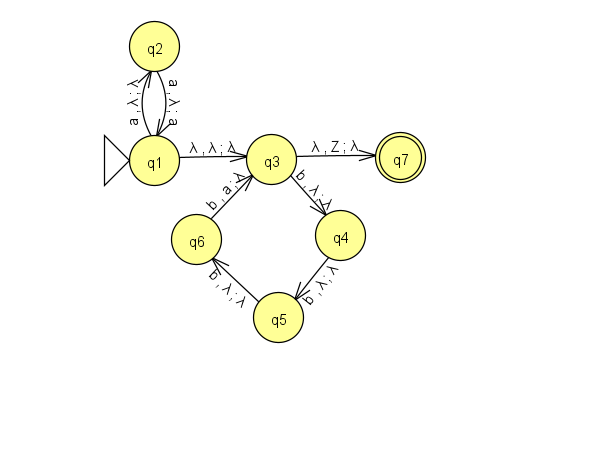
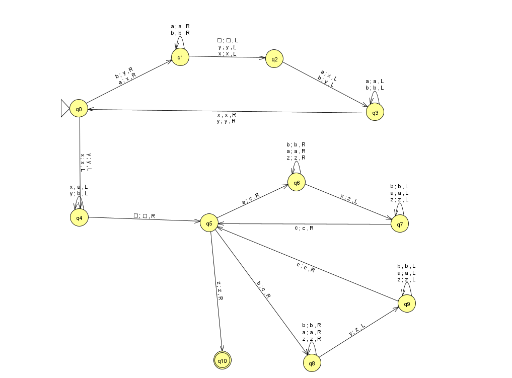
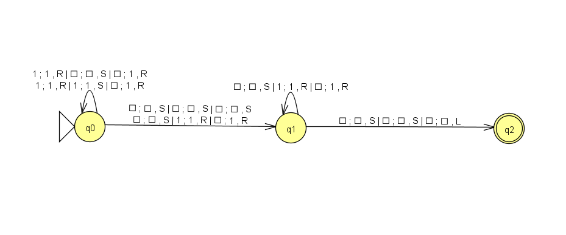

# Automata & Turing Machine Designs

This repository contains solutions for theoretical computer science problems using:
- **PDA (Pushdown Automaton)**
- **STTM (Single Tape Turing Machine)**
- **MTTM (Multi Tape Turing Machine)**

Each problem is explained with a design diagram (included as images) and a brief description.

---

##  Problem 1: PDA Design  
**Language:**  
L = { a²ⁿ b⁴ⁿ | n ≥ 0 }

###  Description:
This PDA accepts strings with double the number of `a`s and quadruple the number of `b`s based on `n`.

### 🖼 Diagram:

---

##  Problem 2: STTM Design  
**Language:**  
L = { ww | w ∈ {a, b}+ }

###  Description:
This Single Tape Turing Machine accepts strings that are made of two identical halves.

### 🖼 Diagram:

---

##  Problem 3: MTTM Design – Unary Addition  
**Task:**  
Add two unary numbers (i.e., represented using only 1’s).  
**Example:**  
`111 + 11 = 11111`

###  Description:
The Multi-Tape Turing Machine reads two unary numbers separated by `+` and outputs their combined total in unary.

### 🖼 Diagram:

